# 🚗 Child Left in Car Prevention System

## 📌 Overview

This project is a **hardware-based electronic system** designed to detect when a child is left unattended in a locked car and trigger immediate alerts to prevent life-threatening situations.

---

## ⚠️ Problem

In recent years, **many cases of children being forgotten in cars** have been reported, sometimes leading to death within minutes due to the greenhouse effect. Even on mild days, the temperature inside a closed vehicle can rise dangerously fast, often by tens of degrees within a few minutes.

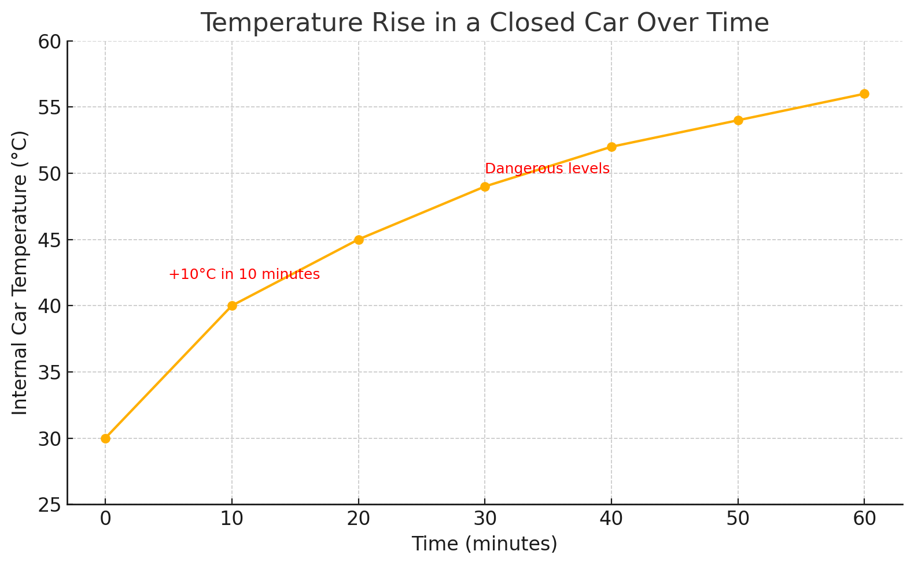

As shown in the graph above, **the internal temperature can increase by more than 10°C within just 10 minutes**, reaching dangerous levels that can lead to heat stroke or death, especially for children.

Main causes include:
- Stress or mental overload
- Routine changes
- Brief moments of inattention

Despite growing public awareness and various campaigns, there is **no simple, low-cost technological solution implemented in all vehicles** to prevent these tragedies.

---

## 🎯 Project Goal

Design a **reliable, low-cost electronic system** that can:
- Detect the presence of a child in a car seat
- Identify when the driver leaves the vehicle
- Trigger **immediate alerts** to the parents and environment
- Prevent disaster before it occurs

---

## 💡 Solution Description

The system uses:
- **Weight sensor** installed in the child seat to detect presence.
- **Vehicle status detection**, monitoring:
  - Engine off
  - Doors locked
  - Parent seatbelt unbuckled while child seatbelt remains buckled

When these conditions are met, the system:
1. **Activates an alarm** with flashing lights and a buzzer to attract attention.
2. If there is no response after a short time:
   - **Sends an alert message** to the parent's mobile phone and ensures receipt.
3. Additional safety measures include:
   - **Measuring internal temperature** and opening windows if temperatures rise dangerously.
   - **Activating an external timer display** on the car window to show how long the child has been left inside, alerting passersby to the urgency.

---

## 🗂️ Project Implementation

- **Simulation**: Initially designed and tested in **Multisim** for circuit verification.
- **Physical Prototype**: Implemented on a breadboard matrix for real-life demonstration.

---

## 🔌 Circuit Schematics

Below are the schematics for the main blocks of the system:

### 📝 Control Block
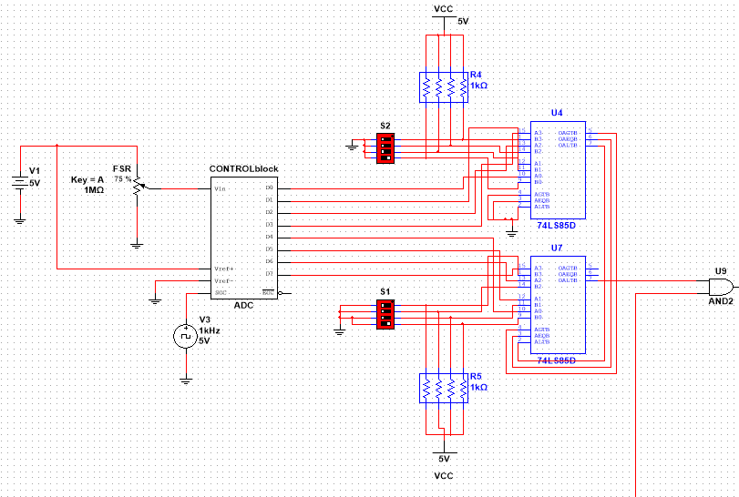

---

### 📝 Seat Belts Sensors
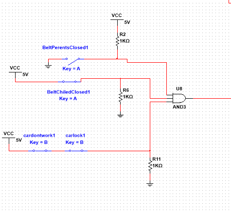

---

### 📝 Temperature Monitoring Block
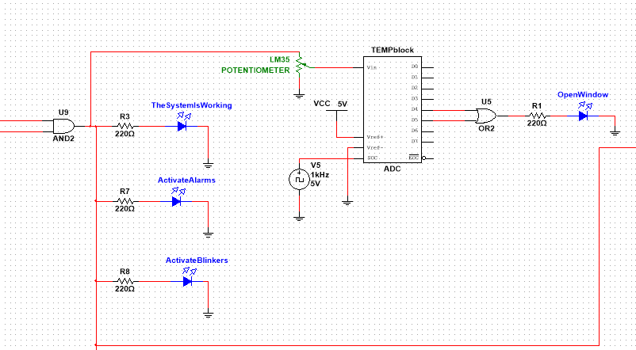

---

### 📝 Message Alert System
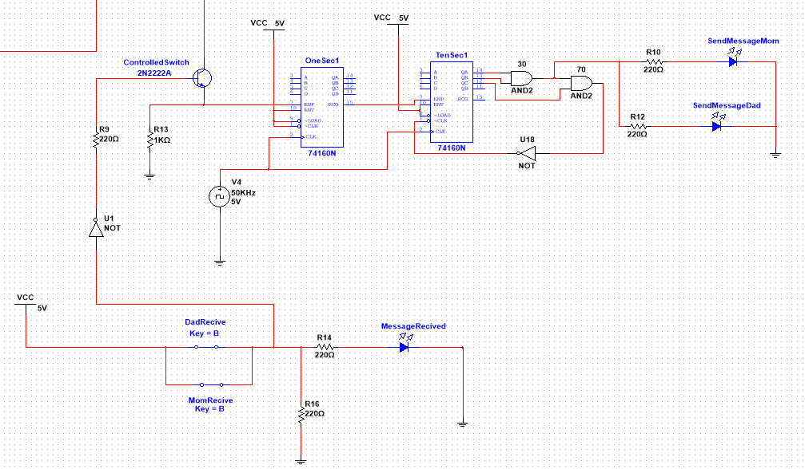

---

### 📝 7-Segment Display System
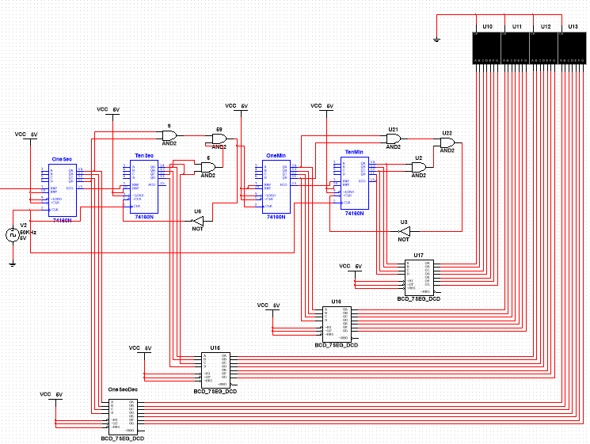

---

### 📝 Overall System Circuit

This is the complete schematic combining all modules:

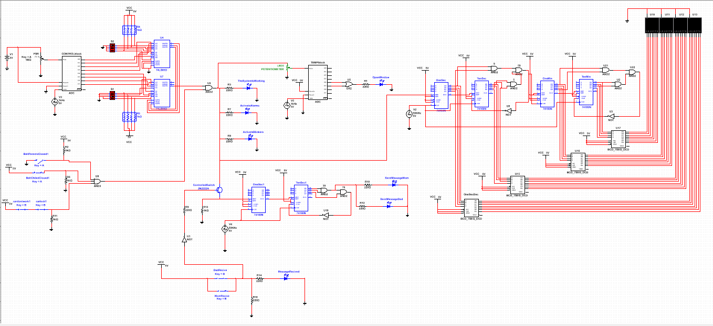

---
## 🖼️ Physical Prototype

Below are photos of the implemented system on breadboards, demonstrating the final physical build:

### 🔧 Full System Overview
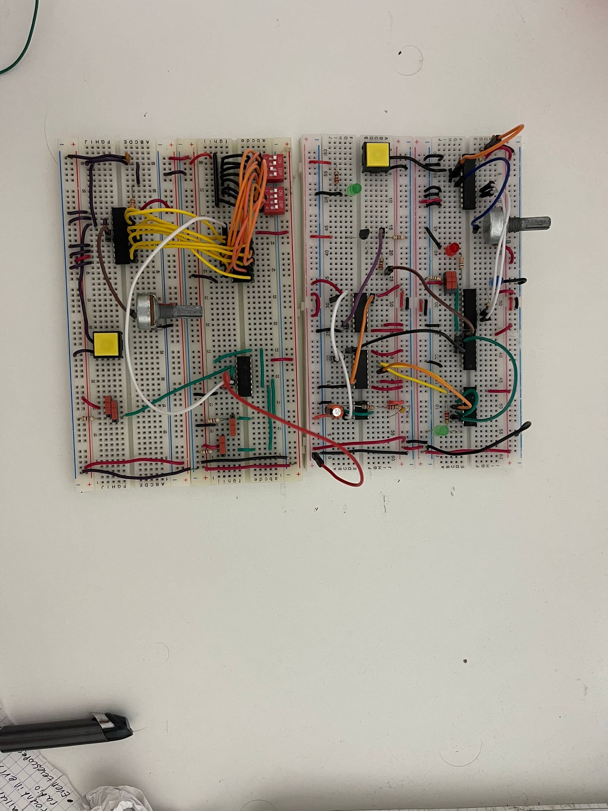

---

### 🔧 Control Block
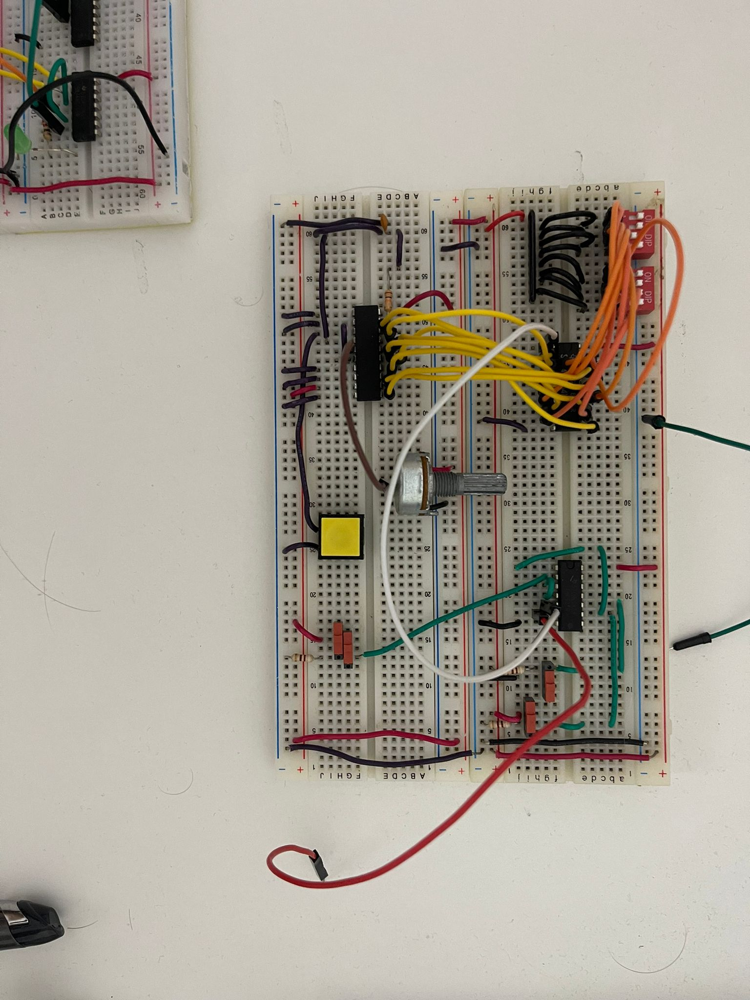

---

### 🔧 Temperature, Analog and Message Blocks
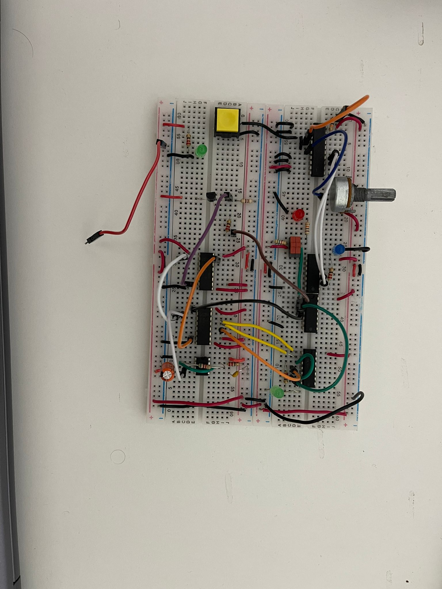

---

### 🔧 7-Segment Display Connections
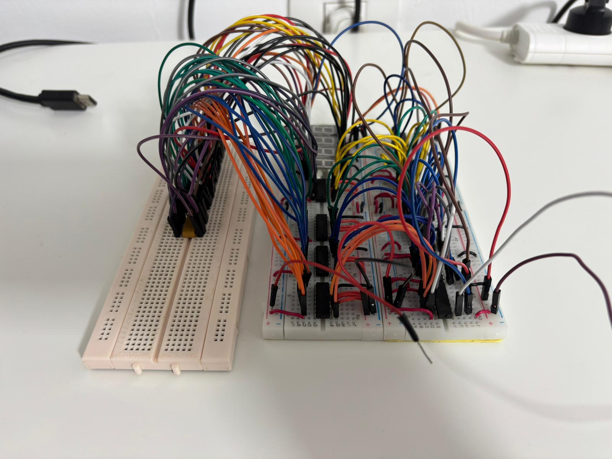

## 🔧 Features

- ✅ Child presence detection via weight sensor
- ✅ Engine and door status detection
- ✅ Driver exit identification
- ✅ Immediate visual and sound alerts
- ✅ Mobile notification system
- ✅ Temperature-based emergency ventilation
- ✅ Timer display for public awareness

---

## 🛠️ Tools Used

- **Multisim** – Circuit simulation
- **Breadboard prototyping**
- **Standard lab equipment** – Power supplies, sensors, amplifiers

---

## 📋 Bill of Materials (BOM)

Below is the list of components used in this project:

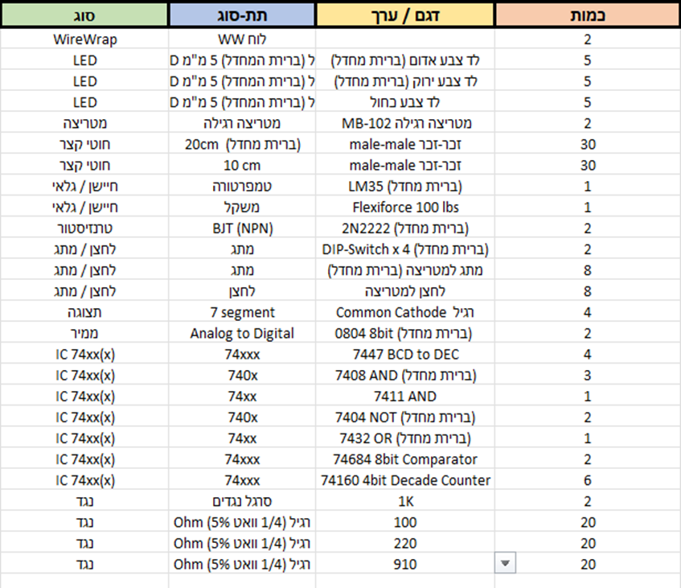

---

## 👤 Author

**Yehonatan Levi**  
Electrical & Electronics Engineering Student

---

*This project is part of my undergraduate hardware design portfolio aimed to improve child safety in vehicles.*
